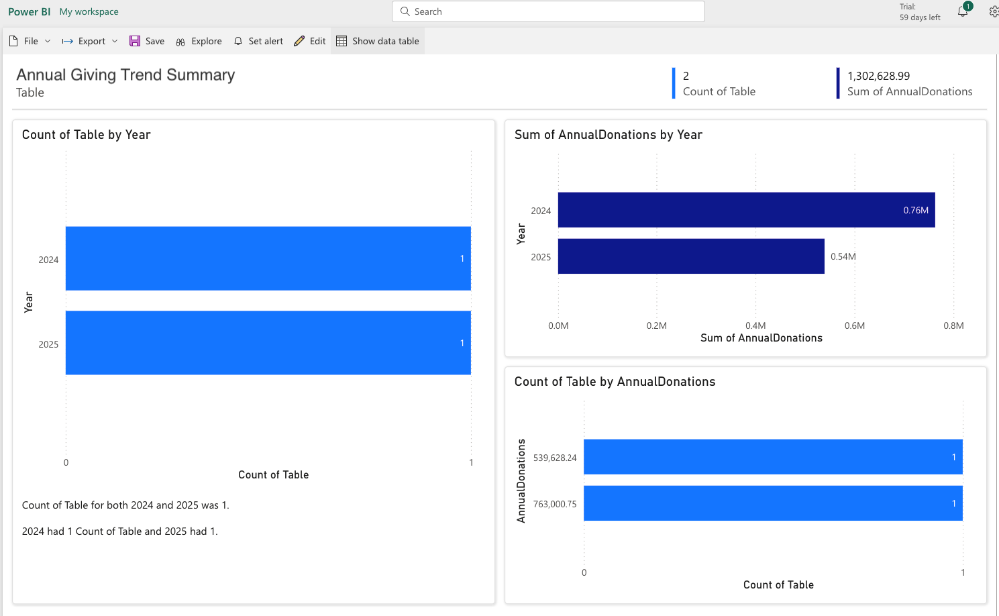

# 📊 Donor Portfolio Analytics Dashboard
A comprehensive interactive dashboard built using SQL + Power BI (online) to track donor engagement, officer performance, and gift value trends. Specifically, This projects illustrates dynamic, end-to-end donor portfolio monitoring dashboard built using **SQL**, **Power BI**, and **Excel** to track fundraising performance, segment donors, and visualize officer engagement.

---

## 🚀 Project Summary

This project simulates and analyzes donor data to help a development team:
- Track outreach efforts
- Segment donors by contribution level
- Visualize officer performance
- Monitor donor stage progression
- Analyze year-over-year giving trends

---

## 🛠️ Tools & Technologies
- **SQL** – for data preprocessing and calculations (contact rate, segmentation, stage distribution)
- **Power BI** – for visual analytics and interactive dashboards
- **Excel** – for initial data simulation and CSV management

---

##### Dynamic Donor Segmentation
SELECT
    CASE
        WHEN TotalGifts > 10000 THEN 'Major Donor'
        WHEN TotalGifts > 5000 THEN 'Mid-Level'
        ELSE 'General'
    END AS Segment,
    COUNT(*) AS DonorCount,
    SUM(TotalGifts) AS TotalAmount
FROM DonorPortfolio
GROUP BY Segment;

---

##### gift over time (time series)
```
SELECT 
    YEAR(LastContactDate) AS Year,
    SUM(TotalGifts) AS AnnualDonations
FROM donor_db.DonorPortfolio
WHERE LastContactDate IS NOT NULL
GROUP BY Year
ORDER BY Year; ```

---

##### average gift by officer
```
SELECT 
  AssignedOfficer,
  AVG(TotalGifts) AS AvgGift
FROM donor_db.DonorPortfolio
GROUP BY AssignedOfficer;```

---

##### stage distribution per officer

```
SELECT 
  AssignedOfficer,
  Stage,
  COUNT(*) AS DonorCount
FROM donor_db.DonorPortfolio
GROUP BY AssignedOfficer, Stage;```

---

##### donor by last contact date
```
SELECT 
  AssignedOfficer,
  COUNT(*) AS TotalDonors,
  COUNT(CASE WHEN LastContactDate >= CURDATE() - INTERVAL 90 DAY THEN 1 END) AS ContactedLast90,
  ROUND(COUNT(CASE WHEN LastContactDate >= CURDATE() - INTERVAL 90 DAY THEN 1 END)*100.0 / COUNT(*), 2) AS PercentContacted
FROM donor_db.DonorPortfolio
GROUP BY AssignedOfficer;```

---

##### gift_distribution.sql
```
SELECT 
    Segment,
    AVG(TotalGifts) AS AvgGift,
    PERCENTILE_CONT(0.5) WITHIN GROUP (ORDER BY TotalGifts) AS MedianGift
FROM donor_db.DonorPortfolio
GROUP BY Segment```

---

```SELECT 
  AssignedOfficer,
  COUNT(*) AS TotalDonors,
  COUNT(CASE WHEN LastContactDate >= CURDATE() - INTERVAL 90 DAY THEN 1 END) AS ContactedLast90,
  ROUND(COUNT(CASE WHEN LastContactDate >= CURDATE() - INTERVAL 90 DAY THEN 1 END)*100.0 / COUNT(*), 2) AS PercentContacted
FROM donor_db.DonorPortfolio
GROUP BY AssignedOfficer;```

---

## 📂 Dataset Fields
Simulated donor portfolio includes:
- `DonorName`
- `AssignedOfficer`
- `LastContactDate`
- `TotalGifts`
- `ProspectScore`
- `Stage` (Discovery → Cultivation → Solicitation → Stewardship)

---

## 📈 Key Dashboard Features

| Insight                          | Description |
|----------------------------------|-------------|
| 🎯 Donor Segmentation            | Major Donor, Mid-Level, General |
| 👤 Officer Performance           | Count of donors, contact rate, average gift |
| 🗓️ 90-Day Contact KPI           | % of donors contacted in last 90 days |
| 🔁 Stage Pipeline                | Distribution across donor stages |
| 🥧 Avg Gift by Officer (Donut)  | Proportional value contribution |
| 📊 Annual Trends                | Year-over-year donation analysis |

---

## 📸 Sample Visuals

> Replace these with your dashboard screenshots

- 
- 
- 
- 
- 

---

## 📁 Folder Structure

```
Portfolio-Health-Dashboard/
├── donor_portfolios.csv
├── power_bi/*all.pbix files
|── data_files/*all.csvs
|──sql/kpi_calculations.sql
   |──segmentation.sql
├── README.md
├── screenshots/
│   ├── Annual_Giving_Trend.png
│   ├── Avg_gift_byOfficer.png
│   ├── Donor_segmentation_summary.png
│   ├── Donors_contacted_90days.png
|   |── Total_gifts_by_Donors.png
│   └── 
```

---

## ✅ How to Use

1. Load the CSV into your SQL database (e.g., MySQL or SQLite)
2. Use provided SQL queries to generate calculated metrics
3. Load into Power BI
4. Customize visuals or extend with real-world data

---

## 💡 Insights Example

- Major Donors account for 87% of total giving
- John Doe manages 31% of the total portfolio
- Emily Zhang has the lowest recent contact rate (13%)
- 2024 giving exceeded 2025 YTD by 41%

---

## 📬 Feedback or Suggestions?

Feel free to [connect on LinkedIn](https://www.linkedin.com/In/foster-dompreh/) or open an issue if you'd like to collaborate or offer improvements.

---
